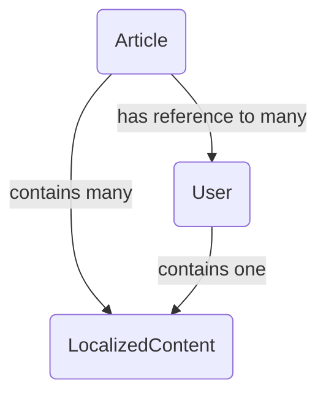

# SuperCamo Example: Basic NodeJS Terminal App

Example of SuperCamo usage in a NodeJS terminal application.


## Models

This example uses documents and embedded documents.

Model schema summaries as follows:

```json
// User - Document
{
    "name":"String",
    "biography":"LocalizedContent subdocument"
}
```

```json
// LocalizedContent - Subdocument
{
    "language":"String",
    "content":"String"
}
```

```json
// Article - Document
{
    "title":["LocalizedContent subdocuments"],
    "content":["LocalizedContent subdocuments"],
    "authors":["User document references"]
}
```

The dependency of the models can be pictured like this:




## Functionality

### CREATE

- [x] Create documents via insertMany
- [x] Create documents via insertOne
- [x] Create documents that refer to other documents by ID
- [x] Create documents that use embedded documents

### READ

- [x] Retrieve all documents in a specific collection as objects
- [ ] Retrieve all documents in a specific collection as document instances
- [x] Retrieve all documents in all collections as objects
- [x] Retrieve all documents in all collections as objects, populating any referenced data
- [ ] Retrieve all documents in all collections as document instances
- [x] Retrieve a specific document by specific query as an object
- [x] Retrieve a specific document by specific query as an object, populating any referenced data
- [ ] Retrieve a specific document by specific query as a document instance

### UPDATE

- [ ] Update document primitive-typed data
- [ ] Update a document's embedded document-typed data

### DELETE

- [x] Delete all documents from all collections
- [ ] Delete a specific document from a specific collection